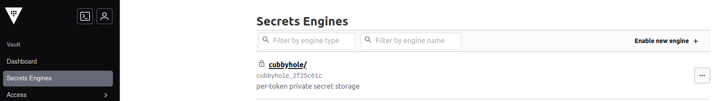
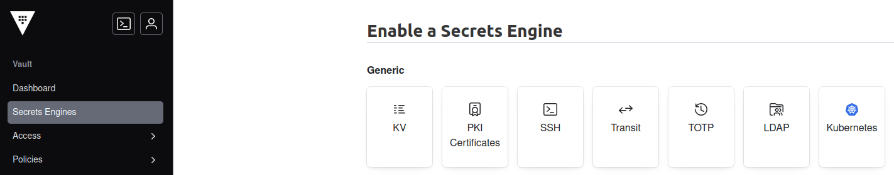
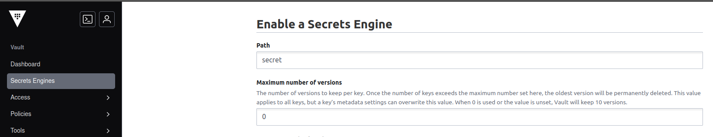
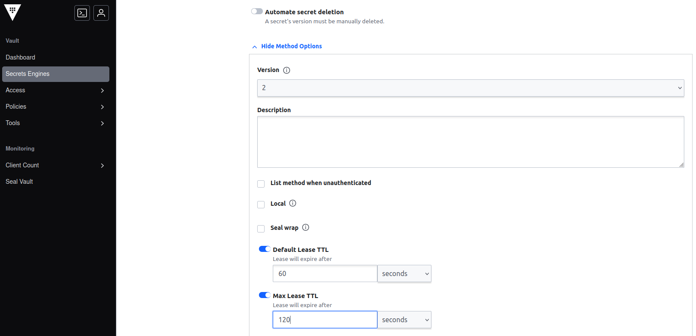
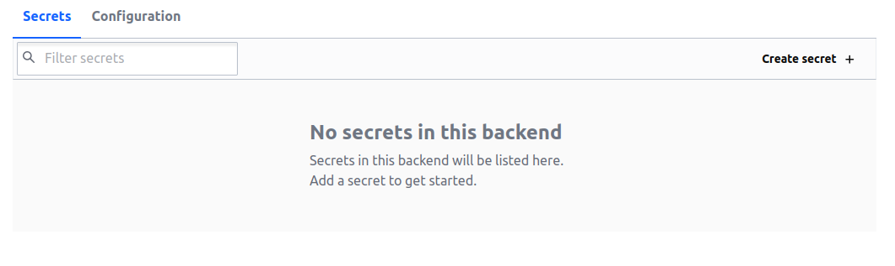
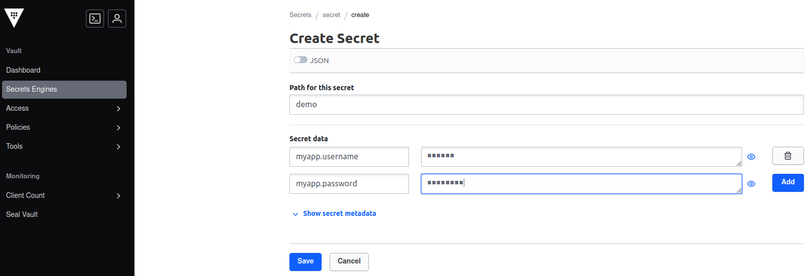
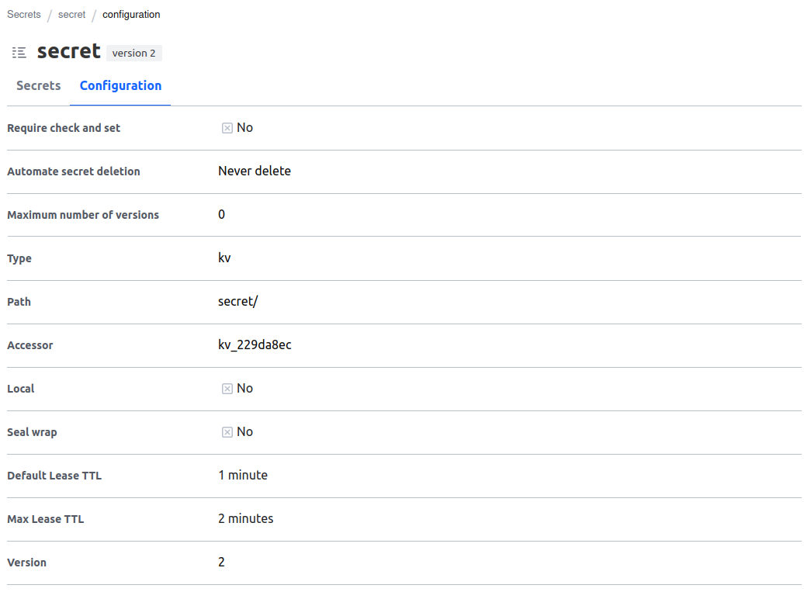
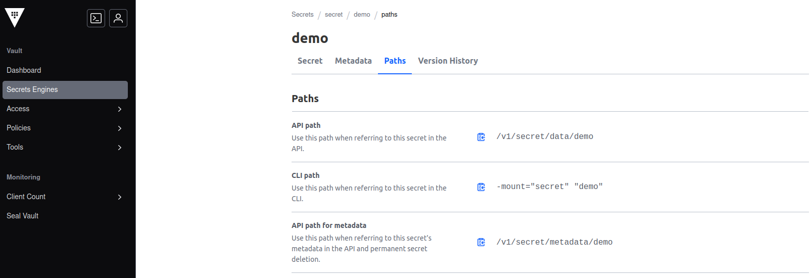

# hashicorpvault-client-sample
Java 17 project, with Spring Boot 3, that exemplify the connection to hashicorp vault, to get the secret keys

### Version
1.0.0

## Resources
* [Spring](https://spring.io)
* [Spring Boot](https://spring.io/projects/spring-boot)
* [Hashicorp Vault](https://developer.hashicorp.com/vault/docs)
* [Lombok](https://www.baeldung.com/intro-to-project-lombok)

### Prerequisites

Things you need to have installed:

```
* Java 17
* Maven
* Hashicorp Vault
* Git
```

## Local Installation

### API Installation
Basically clone the project from the remote repository to the local machine, using the git commands.

```
$git clone [URL].git
```

add the vault secret token in the secrets.yaml file
```
spring.cloud.vault.token=TOKEN
```

### Hashicorp Vault Configuration
You must have the hashicorp vault server installed and the key value secrets created, before calling the API.

To configure the key value secrets in the hashicorp vault, please follow the steps: </br>










### Run

To run the project just use an IDE or use the java command

```
$mvn clear package
$java -jar /target/beom-vault-client-service-0.0.1-SNAPSHOT.jar
```

### Documentation
* [Get Secrets Endpoint](http://localhost:8080/api/v1.0/secrets)

## Authors
**BEOM &copy; since 2024**

